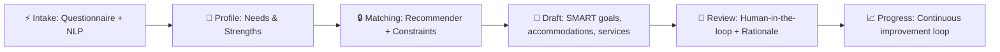
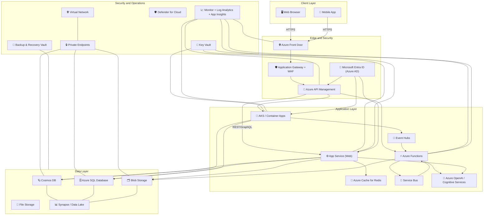
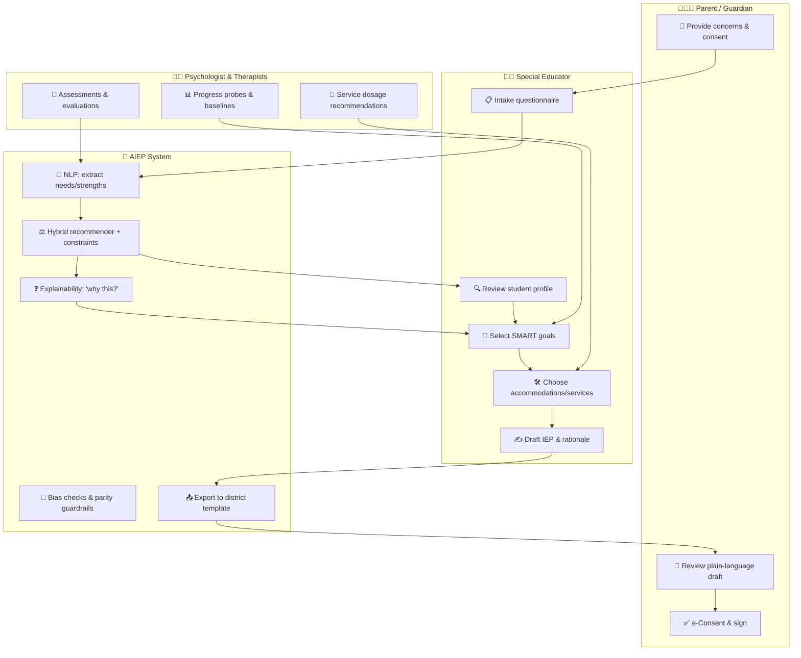

# AI for special Education Planning (AIEP) ✨  
_Public knowledge and special education expertise combined with AI to design effective, tailored learning paths for every child._

🌐 **Website:** [https://www.aieduflow.com/)

<p align="center">
  &nbsp;
  &nbsp;
  &nbsp;
  &nbsp;
  
</p>

<p align="center">
  <b>Mission:</b> Help schools and families craft effective, equitable, and legally compliant IEPs with AI and anonymized data.  
  <br/>
  <i>“Faster drafting, higher acceptance, smaller gaps.”</i>
</p>

---

## ⛳ Quick Navigation
- [🌍 Mission & Problem](#-mission--problem)  
- [🎯 Objectives (SMART)](#-objectives-smart)  
- [👥 Scope & Users](#-scope--users)  
- [🔐 Data & Privacy](#-data--privacy)  
- [🧠 System Overview](#-system-overview--workflow)  
- [📚 Content Libraries](#-content-libraries)  
- [🤖 Model Design & Guardrails](#-model-design--guardrails)  
- [🔌 Integrations & Interoperability](#-integrations--interoperability)  
- [🧩 UX & Accessibility](#-ux--accessibility)  
- [🚀 Quick Start](#-quick-start)  
- [🖼️ Screens & Charts](#-screens--charts)  
- [🗺️ Roadmap](#-roadmap)  
- [🤝 Contributing](#-contributing)  
- [📜 License](#-license)  

---

## 🌍 Mission & Problem
**Mission:** Help schools and families craft effective, equitable, and legally compliant IEPs with AI and anonymized data.  
**Problem:** Teams spend excessive time searching for goals, services, and accommodations; quality varies across sites.  

**Target Outcomes:**  
- ⏱️ Drafting time ↓ 40%  
- ✅ Top-3 acceptance ≥ 80%  
- ⚖️ Parity gaps ≤ 5%  
- 📜 IDEA / 504 aligned  
- 🌎 Inclusive learning practices  

---

## 🎯 Objectives (SMART)
- ≥ 80% educator acceptance of top-3 recommendations within 6 months  
- ≥ 40% drafting time reduction within one school year  
- ≤ 5% subgroup parity gaps  
- Full IDEA/FAPE/504/ADA alignment  
- +15% goal progress vs. baseline in 12 months  

---

## 👥 Scope & Users
**Students:** IDEA (birth–21) + Section 504 plans. Education-focused (no medical diagnosis).  

**Primary Users:**  
- Special educators  
- School psychologists  
- Therapists  
- IEP coordinators  
- Administrators  

**Secondary Users:**  
- Parents/guardians  
- General educators  
- Related service providers  

---

## 🔐 Data & Privacy
- **Sources:** prior IEPs/504s, evaluations, progress, services, outcomes  
- **Anonymization:** identifiers removed; k-anonymity; low-count suppression; pseudonymous linkage  
- **Governance:** FERPA baseline; HIPAA segregation if PHI appears  
- **Security:** encryption, least-privilege IAM, audit logs, penetration testing  
- **AI Governance:** AI + governance by design  

---

## 🧠 System Overview & Workflow


---

## 🌐 Azure Application Architecture



---

## 👩‍🏫 IEP Planning Workflow




## 📚 Content Libraries
- SMART Goal Bank with mastery criteria & probes  
- Accommodations & Modifications (classroom/testing/AT)  
- Interventions & Services with evidence + dosage ranges  
- Specialist roles, referrals, collaboration patterns  

---

## 🤖 Model Design & Guardrails
- NLP extraction with legal-phrase safeguards  
- Hybrid recommender; uncertainty & explanations  
- Fairness: subgroup monitoring, re-ranking constraints, bias audits  
- Safety: human-in-the-loop; transparent “why this?”  

---

## 🔌 Integrations & Interoperability
- Connects to SIS & IEP platforms; import/export;  
- SSO (SAML/OIDC)  
- Webhooks; optional therapy vendor feeds (segregated if PHI)  
- REST/GraphQL APIs  

---

## 🧩 UX & Accessibility
- **Team workspace:** side-by-side profile, recommendations, legal blocks; export to district templates  
- **Parent portal:** plain language, multilingual, e-consent, progress dashboards  
- **Accessibility:** WCAG 2.2 AA; keyboard & screen reader; dyslexia-friendly typography option  

---

## 🚀 Quick Start
```bash
# Clone the repo
git clone https://github.com/your-org/aiep.git
cd aiep

# Install dependencies
npm install

# Run development server
npm run dev
```

---

## 🗺️ Roadmap
- [x] Core recommender system  
- [x] Content library integration  
- [x] Parent portal (Q4 2025)  
- [x] Multilingual support (Q4 2025)  
- [x] SIS vendor integrations  

---

## 🤝 Contributing
Contributions are welcome! Please see [CONTRIBUTING.md](CONTRIBUTING.md).  
We especially encourage educators, parents, and accessibility experts to join.  

---

## 📜 License
Apache-2.0 © 2025 AIEP Project Team
