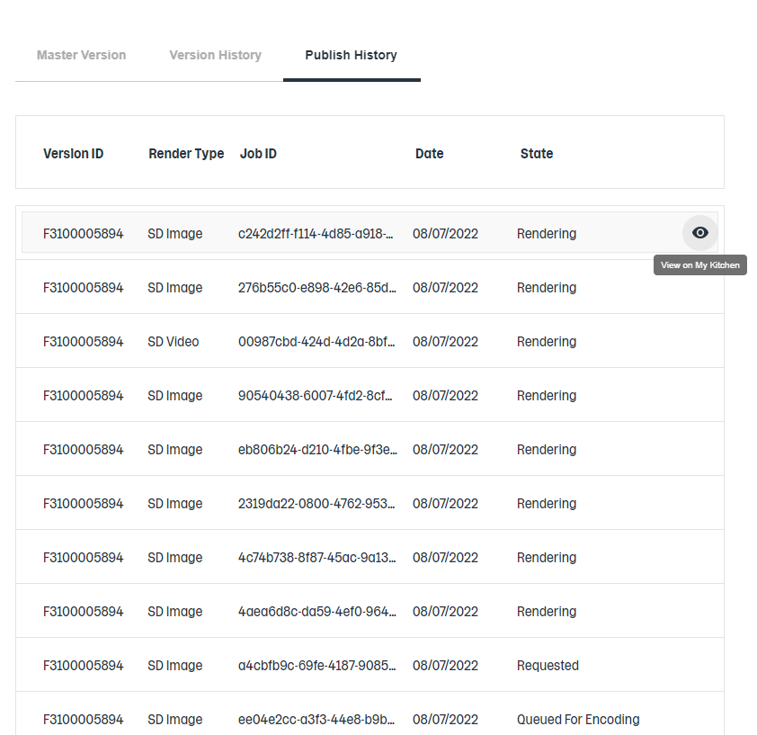

# Education View & Publish System - frontend integration

Calls related to the Publish System are placed in the publish-system.service.ts.

## Publishing Plan Flow
There are two ways to publish Plan in the Education View:
1. On the plan details page, on the Master Version Tab, there is a *"Publish"* button.
2. On the plan details page, on the Version History Tab, there is the *"More Options"* that includes the *"Publish"* button.

Any of those buttons open the Publish form, which needs to be

## Publish Status in the ‘Master Version’ tab

Once the Master Version is published, a publish status label/button will be displayed on the Master Version Tab. 

### Flow:

 1. When opening the Plan page, there is a check if Master Version exists. If it doesn’t exist, the flow stops. If it does: 

 2. Call GetPublishJobsByVersionCode for the Master Version – depending on the response, there are two scenarios:  
    1. If the response array length is zero  - don’t display publish status label/button.  
    2. If the response array length is more than zero, it will get the latest Publish Job status for the Master Version – it sorts the array of Publish Jobs by the UpdatedDate property in descending order. Depending on the stateName it will display three different options:  
        1. If the *stateName* is: *Initialised* | *Requested* | *QueuedForRendering* | *Rendering* | *Rendered*  | *QueuedForRendering* | *Encoding* | *Encoded* | *Published* there will be displayed the **Rendering** label (not clickable).
        2. If the *stateName* is *EmailSent*, it will display the **View on My Kitchen** button. When clicked, a new window with the My Kitchen will be open.
        3. If the *stateName* is: *QueuedForRenderingError* | *SubscribedToRenderingError* | *RenderingError* | *PostRenderingError* | *SubscribedToEncodingError* | *EncodingError* | *PublishedError* | *EmailError* there will be displayed **Publishing Error** label (not clickable).

## View on My Kitchen in the Version History tab

In the Version History tab, for each of the versions in the More Options menu, there is a ‘View on My Kitchen’ option added. 

### Flow:
1. When the user clicks on the **View on My Kitchen** button, it will call GetPublishJobsByVersionCode and depending on the response, there are three possible scenarios: 
    1. If the response array length is zero, the dialog with the message *Version Not Published* will open. 
    2. If the response array length is more than zero, it will get the latest Publish Job status for that specific version and check if the myKitchenUrl property is populated. There are two possibilities from here: 
       1. The link exists, and it will open a new window with the My Kitchen.
       2. The link does not exist, and the dialog with the message *Publishing In Progress* opens up, giving the user information to check for more information in the Publish History tab.

## Publish History Tab
This tab shows the summary of all the publish jobs for each plan version. One version can have many publish jobs.

### Flow: 
1. When opening the Plan page, it calls GetPublishJobsByPlanId. There are two scenarios: 
   1. If the response array length is zero, the flow stops. 
   2. If the response array length is more than zero, it will sort the Publish Jobs by UpdatedDate property in descending order, and then the table data will be populated with:
      1. Version ID
      2. Render Type:
         - SD images
         - HD images
         - SD images & video
         - HD images & video
      3. Date/Time in the 12-hour format
      4. State that depends on the *stateName* returned:
         - If it is any of: *Initialised* | *Requested* | *QueuedForRendering* | *Rendering* | *Rendered*  | *QueuedForRendering* | Encoding* | *Encoded* | *Published* it will display: **Rendering**
         - If it is *EmailSent*, it will display: **Email Sent**
         - If it is any of the errors it will display one of the error messages: *QueuedForRenderingError* | *SubscribedToRenderingError* | *RenderingError* | *PostRenderingError* | *SubscribedToEncodingError* | *EncodingError* | *PublishedError* | *EmailError*
   3. When hoovering on the row, there is a View on My Kitchen icon. When a user clicks on it will check if the publication url exists for the selected publish job. There are two possible scenarios: 
      1. If the link exists and it will open a new window with the My Kitchen.
      2. If the link does not exist and the dialog with the message *Publishing In Progress* opens up, giving the user information to check for more information in the Publish History tab.

